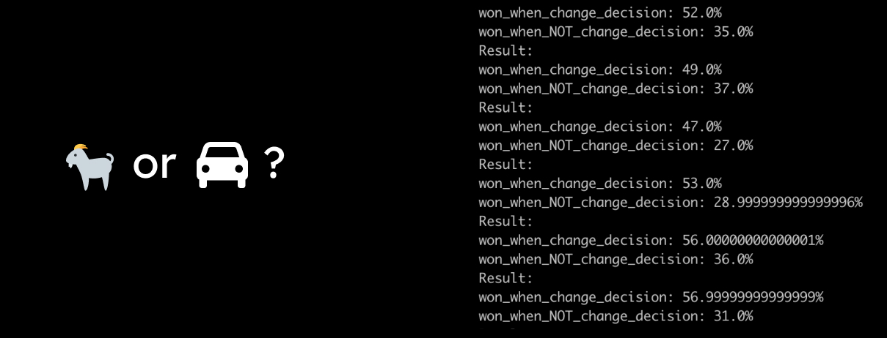

A nice statistic example to play with in Python... You are in a TV show and three doors in front of you. Behind one of them is a car which you win if you choose the right door. The other two have only goats behind them. You select a door, the game master opens one of the goat doors and asks you "Do you want to want to choose another door or stay with your decision"?

Want to support the development and stay updated?

 